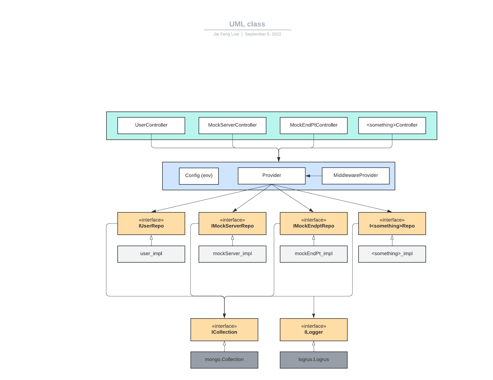
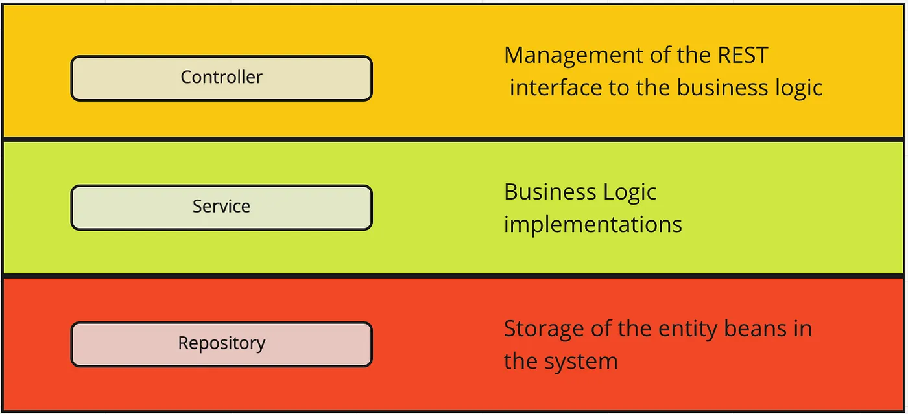

# Walkthrough for Sandbox Code

Most of the logic for the sandbox application is defined in the `/internal` directory.
Structs in this directory implements the interfaces specified in the `/domain` directory.

## Diagram



This application follows the `Controller-Service-Repository` pattern (a lot of inspiration from `Laravel` and `Spring`), with the following:

    Legend:

    - Green: Controllers
    - Blue: Service Provider
    - Light grey: implementations in the `/internal` directory
    - Yellow: interfaces in the `/domain` directory
    - Dark grey: external dependencies

## Explanation



### Controller

The Controller layer, at the top of this picture, is solely responsible for exposing the functionality so that it can be consumed by external entities (including, perhaps, a UI component). If someone wants to access this business logic, they go through a Controller to get there. The Controller layer is the only layer that should know about the HTTP protocol, and is just passing the work down to the `Service` layer.

### Service

The Service layer is where all the business logic should go. This layer is responsible for orchestrating the flow of data between the Controller and the Repository layers. The service layer does not know anything about the database, and should not know anything about the HTTP protocol. If the business logic requires fetching/saving data, it wires in a Repository. This layer can also be tested as a POJO, and by mocking the repository, you can test the business logic without having to worry about the database. Services will have `repositories` injected into them, and can query multiple `Repository` gorups and combine their data to form new, more complex business objects.

### Repository

The Repository layer, at the bottom of this picture, is responsible for storing and retrieving some set of data. This layer is the only layer that should know about the database.
If the business logic requires fetching/saving data, it wires in a Repository. These classes handle getting data into and out of our data store, with the important caveat that each Repository only works against a single Model class. This means that if you need to fetch data from multiple models, you need to use multiple Repositories. This is a good thing, because it means that each Repository is only responsible for a single thing, and is therefore easier to test and maintain.

### Models

The models are the data structures that are used to store data in the database. These models are defined in the `/domain` directory, and are used by the Repository layer to store and retrieve data.

## Directory Overview

### `/domain` directory

This folder holds interfaces and the simplest form of each DB model possible (represented as structs, with the corresponding `bson` and `json` tags).

The `bson` tags tell the mongo driver how to store these Go structs into the database, while the `json` tags tell the json encoders how to convert these from Go structs to JSON objects.

Things in the `/domain` directory are used everywhere in the application, functioning much like a source of truth. This separation also helps to prevent cyclic dependencies.

### `/internal` directory

This folder holds the concrete implementation of each model, as well as the code needed to start up the server. Where possible, each struct/function relies on an interface/DB model from `domain`, rather the actual implementation itself (following the Dependency Inversion (D) in SOLID principles).

#### Subdirectories

##### `/common`

Some common utilities for the whole application, such as formatting `http.ResponseWriter`.

##### `/controllers`

Holds controller methods to handle incoming http requests.

##### `/models`, but really it should be called `/repo`

Holds implementation for each of the `I<something>Repo` specified in `/domain`, much like a repository over each database model. Should be called `/repo`. This is separated from controllers to prevent cyclic dependencies.

##### `/mw`

Middlewares for the application, such as authentication.

##### `/server`

Code to start up the server.

## Walkthrough on how the server is spun up

The code for this resides in `/internal/server/server.go`. The flow goes something like this:

1. Setup the Provider struct. This struct sets up the config, logger and all the repositories (i.e. interface implementations), so that they can be injected into each controller (more on this later).
2. Setup the MiddlewareProvider, which handles application/authentication middleware.
3. Setup CORS on the server.
4. Setup API routes.
5. Setup sandbox handler.
6. List routes for the whole server
7. Listen on the ports

## Walkthrough for the Provider

Each controller depends on at least one thing from the model layer. Instead of having each controller relying on the model directly, each controller depends on the corresponding interface.

The dependents of each controller are aggregated in the Provider struct, which are then injected into the various controller (i.e. using dependency injection) while setting up the API server.

The reason for this is to support testing. If the controller depends on the actual implementation of the model, unit testing will be hard (likely will need a real db connection, which is not ideal).

The flow for the Provider goes something like this:

1. Setup config from environment variables
2. Connect to MongoDB
3. Setup logger
4. Setup each repository

## Additional Notes

Since interfaces in Go are implicitly satisified, some of the code is worth examining in more detail.

1. `/internal/logger.go`.
   This file creates the logger to be used for the whole application.

```go
    func getLogger() domain.ILogger {
        return &logrus.Logger{
            ...
        }
    }
```

We return an instance of `logrus.Logger` from the `logrus` library in this function. But we set the return value to be an interface from `/domain` instead of the real underlying `logrus.Logger` instance. We can do this as `logrus.Logger` from the library satisfies the methods `domain.ILogger` that we defined, which means it satisfies the interface. It is somewhat like casting the `logrus.Logger` into our interface.

With this, the dependents depend on the `domain.ILogger` interface rather than the `logrus.Logger` instance, making it mockable for testing.

2. Separating MongoDb collection with an interface.

```go
    // in Provider.go
 p.UserRepo = models.NewUserModel(
  p.Db.Collection("users"), p.Logger)
    // where p.Db.Collection("users") returns *mongo.Collection

    // in /internal/models/user_impl.go
    func NewUserModel(coll domain.ICollection, log domain.ILogger) (m *UserModel) {
        ...
    }
```

By closely examining the Provider code, we can see that:

- `p.Db.Collection("users")` returns something of type `*mongo.Collection`.
- But, we can pass `*mongo.Collection` off as `coll domain.ICollection` in the `NewUserModel()` method.

This works because Go interfaces are implicitly satisfied. `mongo.Collection` satisfies the methods in `coll domain.ICollection`. So, we can pass in `mongo.Collection` for `domain.ICollection` (even though `domain.ICollection` is our own interface, which is just us copying methods from `mongo.Collection` into an interface).
